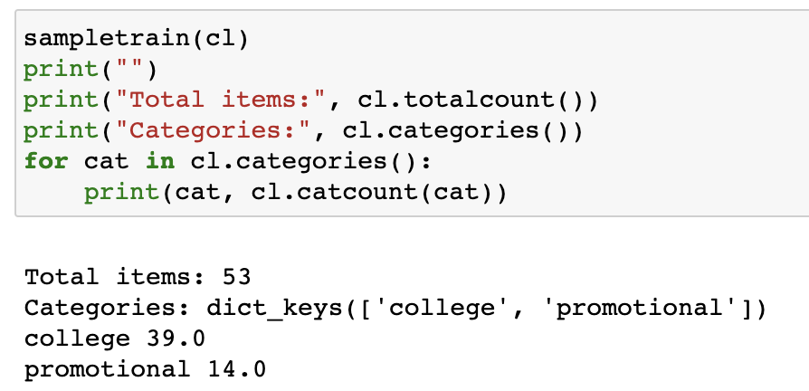

# Homework 9 - Email Classification
**Due:** Sunday, December 13, 2020 by 11:59pm 

## Reports
* CS 432 students *may* complete this report in Markdown. Or, you may choose to use LaTeX instead. 
* CS 532 students *must* complete this report using LaTeX generated to a PDF file (GitHub repo must contain both the LaTeX source and PDF).
* Any graphs required for your reports must be done in R or using a Python plotting library (see ["The 7 most popular ways to plot data in Python"](https://opensource.com/article/20/4/plot-data-python)) -- Excel graphs are unacceptable!
* When you include an image in your report, *do not change the [aspect ratio](https://en.wikipedia.org/wiki/Aspect_ratio_(image)) of the image*. If you have trouble with this, ask for help in our Piazza group.

Reports are not just a list of questions and answers, but should include descriptions, screenshots, copy-paste of code output, references, as necessary.  For each question you address, you must describe how you answered the question.  

You may use existing code, but you **must** document and reference where you adapted the code -- give credit where credit is due! *Use without attribution is plagiarism!*

All reports must include your name, class (make sure to distinguish between CS 432 and CS 532), assignment number/title, and date.  You do not need a title page.  

## Assignment

In this assignment, you will be classifying email into two groups based on topic -- either "on topic" or "not on topic".  You can choose the topic based on what types of emails you typically receive (or what you have access to).

Write a report that answers and explains your answers to the following questions. Support your answers by including all relevant discussion, assumptions, examples, etc. *You must describe how you answered the questions.* Your GitHub repo should include all scripts, code, output files, images needed to complete the assignment. If you use a Google Colab notebook, you must save a copy in GitHub in your HW repo.

### Q1. Create two datasets, Testing and Training.

You may choose a topic to classify your emails on (but choose only 1 topic). This can be spam, shopping emails, school emails, etc.  You must describe in your report what you will be classifying on.

The **Training** dataset should consist of
* 20 text documents for email messages you consider on your chosen topic
* 20 text documents for email messages you consider *not* on your chosen topic

The **Testing** dataset should consist of:
* 5 text documents for email messages you consider on your chosen topic
* 5 text documents for email messages you consider *not* on your chosen topic

Make sure that these are plain-text documents and that they do not include HTML tags.  The documents in the Testing set should be different than the documents in the Training set.

Upload your datasets to your GitHub repo. *Please do not include emails that contain sensitive information.*

### Q2. Naive Bayes classifier
Use the provided example code (see https://github.com/cs432-websci-fall20/assignments/blob/master/432_PCI_Ch06.ipynb) to train and test the Naive Bayes classifier.  Use your *Training* dataset to train the Naive Bayes classifier.  Use your *Testing* dataset to test the Naive Bayes classifier and report the classification results for each email message in the *Testing* dataset.

### Q3. Confusion Matrix
Draw a confusion matrix for your classification results (see [Week-13 Document Filtering](https://docs.google.com/presentation/d/1TgSeYh7gjpxl8f_9-FKG7MnXG1HI_iwH_KDFyUgKlWU/edit?usp=sharing), slides 40, 42, 43).

For this assignment, the amount of item collected for the college training emails were a lot more than those for promotional emails. This created a bias toward college. This made a lot of tests resulting in college. The majority of tests were successful and classify the emails in the right category. The program did not read my emails when I load them directly from the file. As a workaround, I copied segments of the emails and pasted them in the classifier. This is shown in the attached image. 
This assignment helped me to understand the use of probability to predict the category of test Information based on data entered as training information. Naive Bayes classifier did a great job in predicting the classification of the test data.  

* 

Report the precision and accuracy scores of your classification results (see Week-13 Document Filtering, slide 43).

### Q5. 
*(Extra credit, 2 points)* 

Tune your classifier by updating weights to obtain better classification results. You may want to change the default weights (`weight`, `ap`) given to `weightedprob()` or the threshold used for the Bayesian classifier or change how the words are extracted from the document (for this you will need to re-train the model).  Report the changes you made, re-run your Testing dataset, and show that the performance improved (either by using the confusion matrix or by computing precision and accuracy).

### Q6. 
*(Extra credit, 4 points)* 

Implement the classifier with the Multinomial model instead of the multiple Bernoulli model and re-run Q2 and Q3.  Did the classification improve?  *Make sure to remove the unique word filter from the extractor.*

*For credit on this part, you must describe what you have done and discuss the differences between the Multinomial model and the multiple Bernoulli model.*

## Submission

Make sure that you have committed and pushed your local repo to GitHub.  Your repo should contain any code you developed to answer the questions.  Include "Ready to grade @weiglemc @brutushammerfist" in your final commit message. 

Submit the URL of your *report* in Blackboard:

* Click on HW9 under Assignments in Blackboard
* Under "Assignment Submission", click the "Write Submission" button.
* Copy/paste the URL of your report into the edit box
  * should be something like https<nolink>://github.com/cs432-websci-fall20/hw9-classify-*username*/blob/master/HW9-report.{pdf,md}
* Make sure to "Submit" your assignment.
